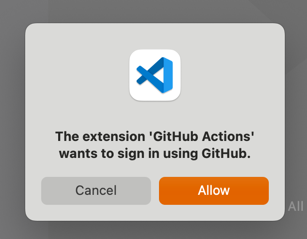

> **Note**
>
> GitHub is currently working on officially supporting this extension. Read more about our plans in our [public roadmap issue](https://github.com/github/roadmap/issues/564). We will be dedicating resources to cleaning up the extension, squashing bugs, and more so your experience with Actions in VS Code is better than ever!

# GitHub Actions for VS Code

Simple extension to interact with GitHub Actions from within VS Code.

## Setup

1. Install the extension from the [Marketplace](https://marketplace.visualstudio.com/items?itemName=cschleiden.vscode-github-actions)
2. Open a repository with a `github.com` `origin` git remote
3. When prompted, allow `GitHub Actions` access to your GitHub account:

    

## Features

The extension provides a convenient way to monitor workflows and workflow runs from VS Code as well as language-server features for editing workflow YAML files.

### Auto-complete and documentation

No additional YAML extension needed, this extension includes a built-in language server with support for the workflow schema:

Auto-completion and validation for every action you reference in `uses`:

Auto-completion and validation of labels for hosted and self-hosted runners:

#### Expressions auto-complete

Auto-completion, validation, and evaluation of expressions:

Auto-complete and validate all webhook event payloads:

### Monitor workflow runs

See runs for workflows in the repository, drill into jobs and steps, and inspect logs:

### Other features

- Trigger `repository_dispatch` or `workflow_dispatch` workflow runs
- View registered self-hosted runners and environments for the current repository
- View, edit, and add secrets
- Pin workflow to the VS Code status bar
