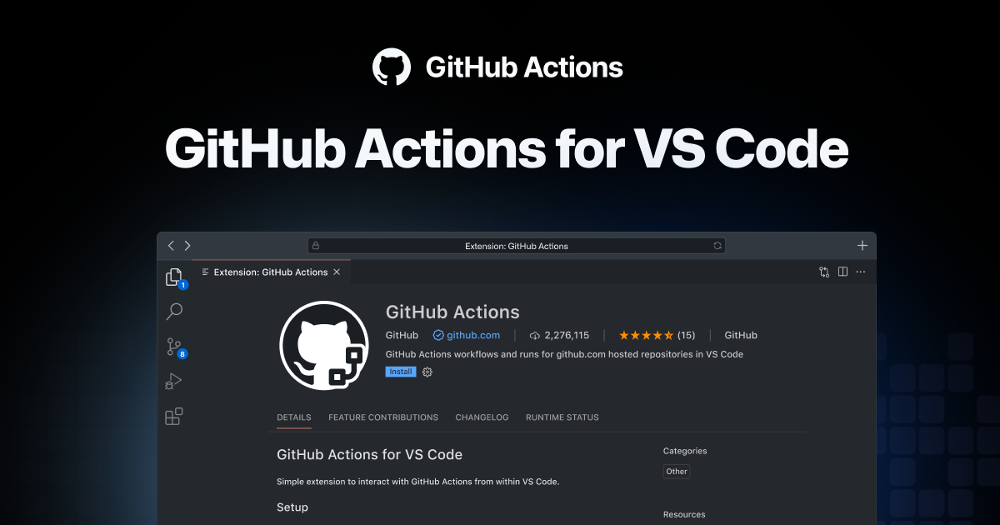
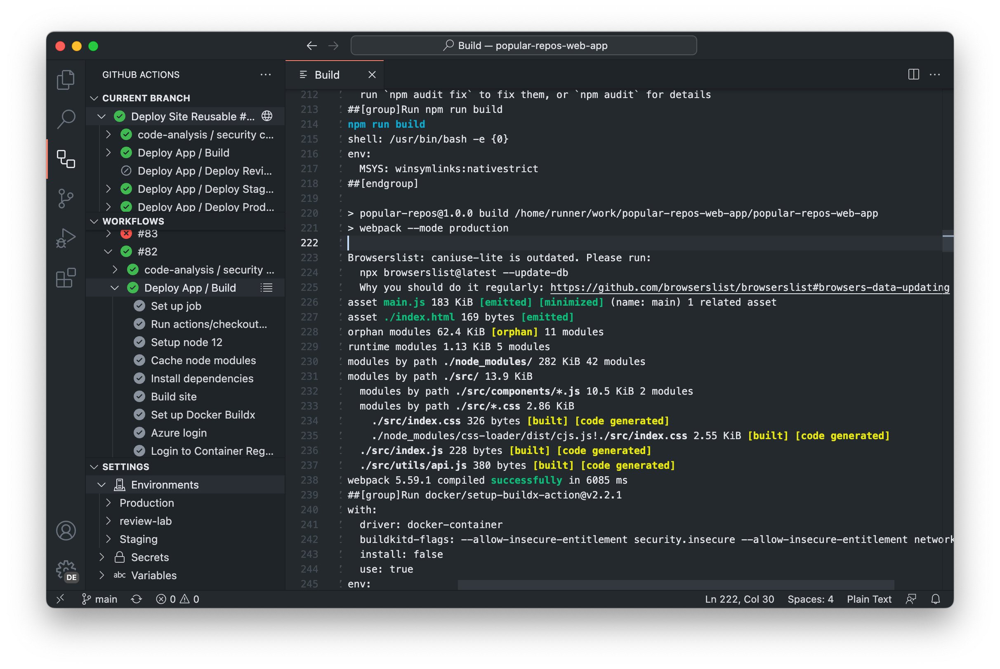
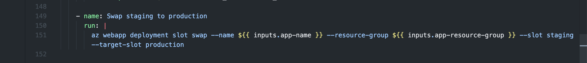
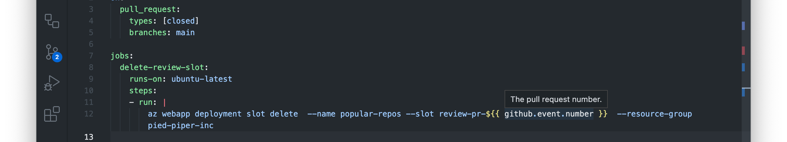
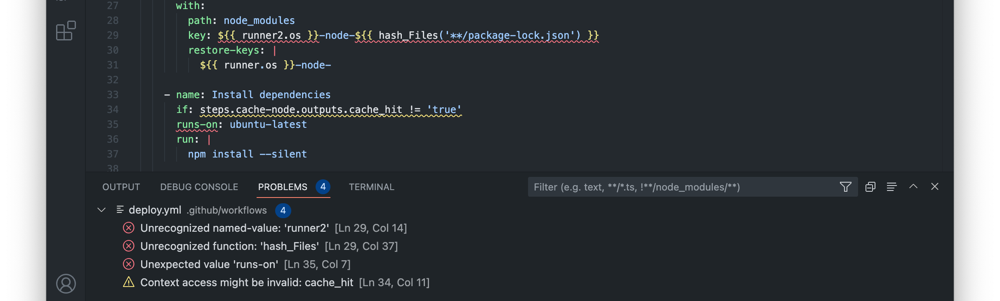

# GitHub Actions for VS Code

The GitHub Actions extension lets you manage you manage your workflows, view the workflow run history, and helps with authoring workflows.

## Features

### Manage workflows and runs

Manage your workflows and runs without leaving your editor. Keep track of your CI builds and deployments. Investigate failures and view logs.

### Workflow authoring

Be more confident when authoring and modifying workflows. Find errors before committing workflows with:

**Syntax highlighting** for workflows and GitHub Actions Expressions makes it clear where values are inserted at execution time:

**Integrated documentation** for the workflow schema, expression functions, and even event payloads:

**Validation and code completion** for the YAML schema and GitHub Action Expressions. Get instant validation and code completion for the workflow schema, expression functions, event payloads, and job or step `outputs`:

**Smart validation and code completion for actions and reusable workflows**: the extension automatically parses parameters, inputs, and outputs for referenced actions and called reusable workflows for code-completion and validation.

## Getting started

1. Install the extension from the [Marketplace](https://marketplace.visualstudio.com/items?itemName=github.vscode-github-actions)
1. Sign in with your GitHub account and when prompted allow `GitHub Actions` access to your GitHub account.
1. Open a GitHub repository

## Contributing

See [CONTRIBUTING.md](../CONTRIBUTING.md).

## License

This project is licensed under the terms of the MIT open source license. Please refer to [MIT](../LICENSE) for the full terms.