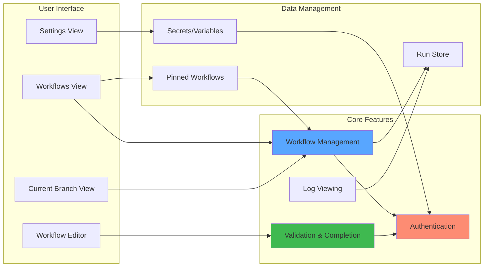
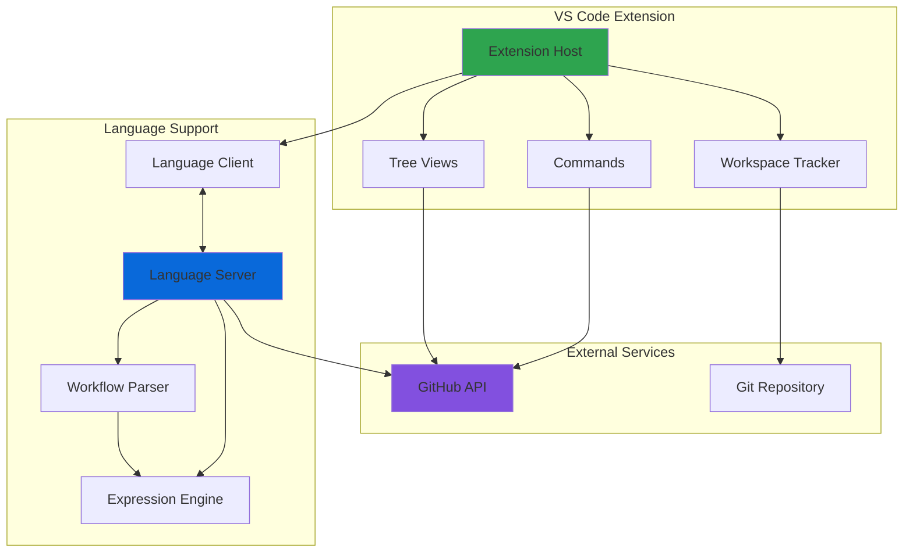

# GitHub Actions for VS Code

The GitHub Actions extension lets you manage your workflows, view the workflow run history, and helps with authoring workflows.

## Features

### Manage workflows and runs

* Manage your workflows and runs without leaving your editor.
* Keep track of your CI builds and deployments.
* Investigate failures and view logs.

### Workflow authoring

Be more confident when authoring and modifying workflows. Find errors before committing workflows with:

**Syntax highlighting** for workflows and GitHub Actions Expressions makes it clear where values are inserted at execution time:

**Integrated documentation** for the workflow schema, expression functions, and even event payloads:

**Validation and code completion** for the YAML schema and GitHub Actions Expressions. Get instant validation and code completion for the workflow schema, expression functions, event payloads, and job or step `outputs`:

**Smart validation and code completion for actions and reusable workflows**: the extension automatically parses parameters, inputs, and outputs for referenced actions and called reusable workflows for code-completion and validation.

## Getting started

1. Install the extension from the [Marketplace](https://marketplace.visualstudio.com/items?itemName=github.vscode-github-actions).
1. Sign in with your GitHub account and when prompted allow `GitHub Actions` access to your GitHub account.
1. Open a GitHub repository.
1. You will be able to utilize the syntax features in Workflow files, and you can find the GitHub Actions icon on the left navigation to manage your Workflows.

## Key Components

<!-- If the Mermaid diagrams below aren't rendering in VS Code preview, install the "Markdown Preview Mermaid Support" extension -->

## Supported Features

- Manage your workflows and runs 
- Edit workflows (syntax highlighting, auto-completion, hovering, and validation)
- Keep track of your CI builds and deployments
- Investigate failures and view logs
- Modify settings like Environments, Secrets, and Variables

Unfortunately, at this time we are not able to support the extension with [remote repositories](https://docs.github.com/en/get-started/getting-started-with-git/about-remote-repositories) (including [github.dev](https://github.dev/) and [vscode.dev](https://vscode.dev/)), so please use the extension with locally downloaded GitHub repositories for the best experience. Please check back here for updates in the future!

We have enabled experimental functionality to support GitHub Enterprise Server, but this feature is an experimental beta and currently unsupported. To try this out, enable the `use-enterprise` setting to authenticate with your `GitHub Enterprise Server Authentication Provider` settings

We currently do not have the capability to support Operating System (OS) certificates or enterprise proxies (we plan to support pulling from the VS Code proxy settings), but we have plans for it in the future and it is on our backlog! 

## Architecture Overview

## Contributing

See [CONTRIBUTING.md](CONTRIBUTING.md). A description of the architecture of the extension can be found [here](./docs/project-architecture.md).

## License

This project is licensed under the terms of the MIT open source license. Please refer to [MIT](LICENSE) for the full terms.
