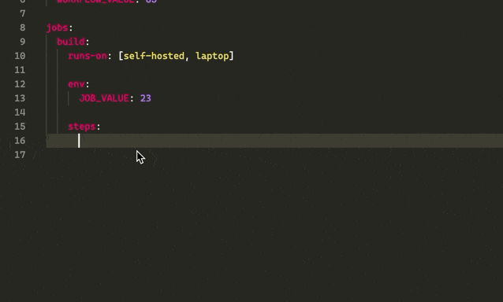
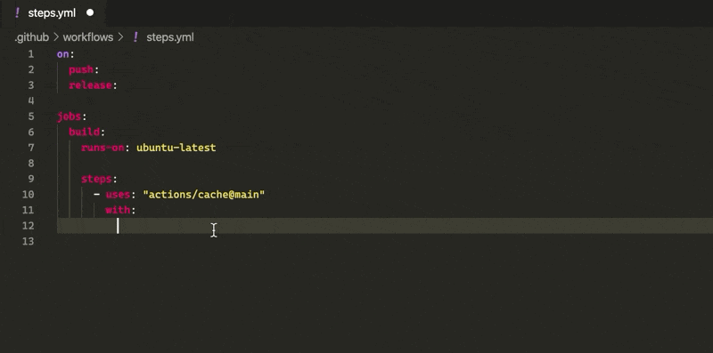
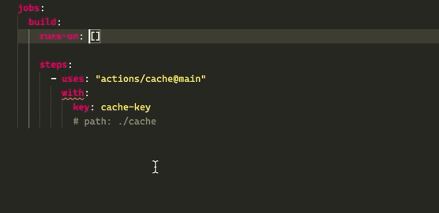
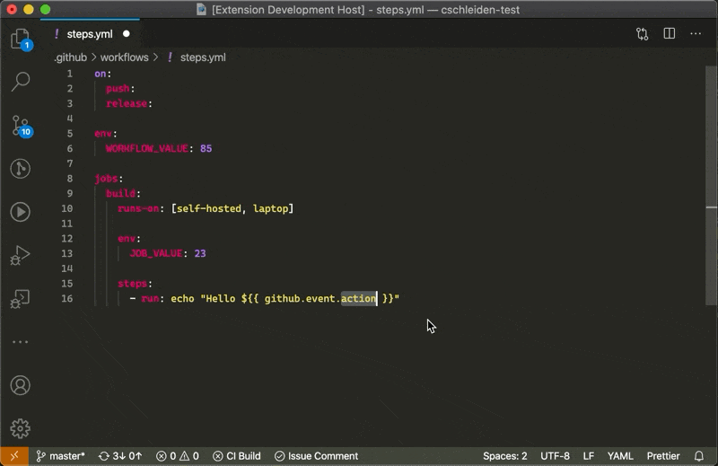
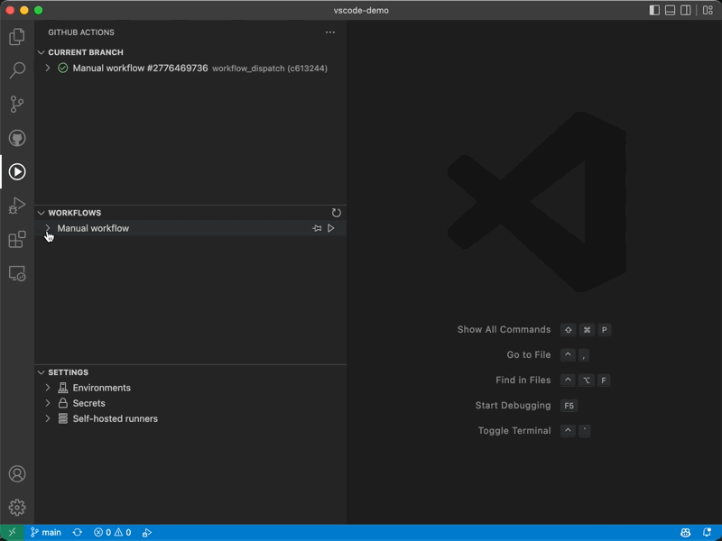
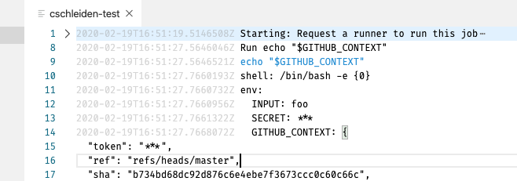
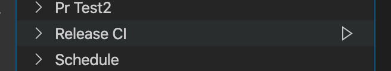
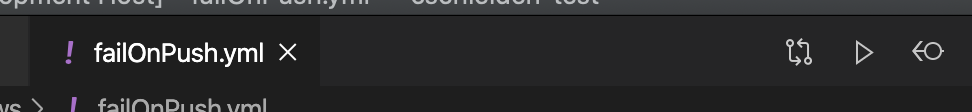

# GitHub Actions for VS Code

[](https://github.com/cschleiden/vscode-github-actions/actions/workflows/build.yml)

Simple, **unofficial** extension to interact with GitHub Actions from within VS Code.

## Installation

1. Install extension
2. Open a repository with a `github.com` origin
3. When prompted, allow `GitHub Actions` to access your `github` account from the "Accounts" menu:

    

## Features

### Auto-complete and documentation

No additional YAML extension needed, this extension includes a built-in language server with full support for the workflow schema.



### Auto-complete actions parameters

Auto-completion and validation for every action you reference in `uses`:



### Auto-complete runner label



### Smart auto-complete and evaluation of expressions


### Auto-complete and validate `github` event expressions

The extension knows about all the webhook payloads and suggests and auto-completes event payload fields



### View workflows for the currently opened repository


### View workflow runs and their status


### Inspect logs to see failures





### Trigger runs

If a workflow uses `repository_dispatch` as a trigger, you can start a new workflow run from the workflow context menu:


Or from the workflow list:



Or from the editor when editing a workflow:



### Pin workflows and see their status updated automatically

You can pin workflows to the status bar per workspace, and automatically see the status of the most recent run. For example, to see if the change you just pushed passes the CI Build:


1. To setup, configure the `"github-actions.workflows.pinned.workflows"` property on a global level, or per workspace (`.vscode/settings.json`):

```json
{
    "github-actions.workflows.pinned.workflows": [".github/workflows/build.yml", ".github/workflows/create.yml"],
}
```

2. To enable auto-refresh via polling, set `refresh.enabled` to `true`. This works by polling the workflow runs API with a default interval of `30` seconds. You can customized the interal via `refresh.interval`:

```json
{
    "github-actions.workflows.pinned.workflows": [".github/workflows/build.yml", ".github/workflows/create.yml"],
    "github-actions.workflows.pinned.refresh.enabled": true,
    "github-actions.workflows.pinned.refresh.interval": 65,
}
```


## Known issues

