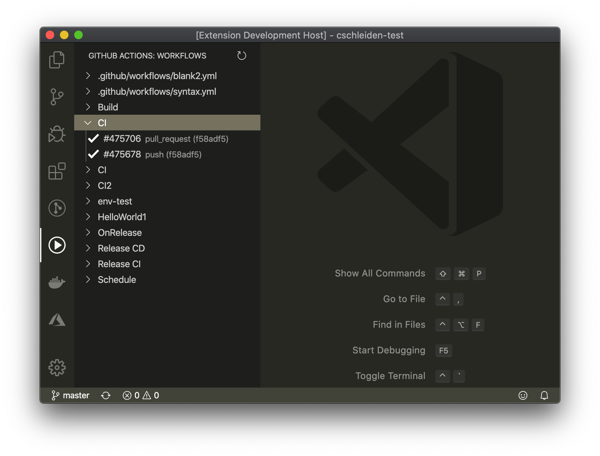

# GitHub Actions for VS Code

Very simple, unofficial extension to interact with GitHub Actions from within VS Code.

# View workflows for the currently opened repository

# View workflow runs and conclusions

# Trigger runs

If a workflow uses `repository_dispatch` as a trigger, you can start a new workflow run from the VS Code view:

