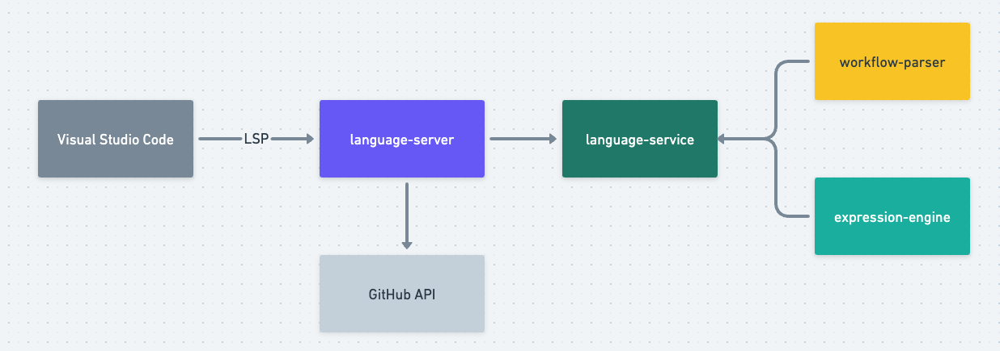

# Project Architecture

This is a high-level overview of the Visual Studio Code Extension. The intended audience is someone interested in contributing the extension.

## Background

Visual Studio Code provides an [API](https://code.visualstudio.com/api/language-extensions/overview) for implementing language-specific editing features in an extension. In VS Code, a language editor extension has two main components:

- a **language client** which is a normal VS Code extension that listens to different editor events and sends the payloads of these events to a language server
- a **language server** which is performs language analysis on the code written within VSCode (this runs in a separate process for performance reasons)

The language client and server communicate via the Language Server Protocol. The [Language Server Protocol](https://microsoft.github.io/language-server-protocol/) defines a standardized communication protocol between an editor (in our case Visual Studio Code) and a language server that implements features like autocomplete and syntax checking.

By making the language server implementation LSP compliant we have set ourselves up to integrate with other text editors in the future.

Fundamentally, the extension takes in a string of text (YAML specifying a GitHub Actions workflow) and needs to make sense of the text. Conceptually, what this extension does is similar to what other compilers and interpreters (e.g., [LLVM](https://aosabook.org/en/v1/llvm.html)) do. The basic steps form a pipeline, with the output of one step serving as the input to the next step. Broadly speaking the steps involved are:

1. A lexer takes in a stream of text (in this case a workflow file) and breaks the text into the atomic chunks of the language called tokens
2. Next, the tokens are fed into the parser which constructs a tree representation of the program
3. Lastly, the tree is evaluated. This step takes the syntax tree as input and produces a literal value.

_Crafting Interpreters_ - which can be read freely online [here](https://craftinginterpreters.com/contents.html) - goes into much greater depth about compiler/interpreter development.

## Architecture

The [VS Code extension](https://github.com/github/vscode-github-actions) integrates with Visual Studio code and uses [open-source libraries](https://github.com/actions/languageservices/tree/main) in order to provide its full functionality. The extension initializes the language server and performs other non-language related tasks like adding functionality to the VS Code sidebar.

The open-source language libraries that the extension uses are:

- The [language server](https://github.com/actions/languageservices/tree/main/languageserver) library is a wrapper around the language service
    - it handles the connection with VS Code via the Language Service Protocol
    - makes API calls to GitHub (e.g., requesting [Action secrets](https://docs.github.com/en/rest/actions/secrets?apiVersion=2022-11-28)) for repository and workflow information
- The [language service](https://github.com/actions/languageservices/tree/main/languageservice) library uses the workflow parser and expression engine (described below) to implement the core functionality of the extension
    - it calls into the language server for any data that requires an API call
- the [workflow-parser](https://github.com/actions/languageservices/tree/main/workflow-parser) library parses GitHub Actions workflows into an intermediate representation and validates that the workflow file is syntactically valid
    - the workflow parser uses a [schema](https://github.com/actions/languageservices/blob/main/workflow-parser/src/workflow-v1.0.json) to parse the workflow file
    - the schema defines the list of valid tokens and their arguments
- the [expressions](https://github.com/actions/languageservices/tree/main/expressions) engine is used to parse and evaluate GitHub Actions [expressions](https://docs.github.com/en/actions/learn-github-actions/expressions)

## Useful Links

- [actions/languageservices](https://github.com/actions/languageservices) is the monorepo where all language services code for GitHub Actions can be found
- [GitHub Actions Expression Language Documentation](https://docs.github.com/en/actions/learn-github-actions/expressions)